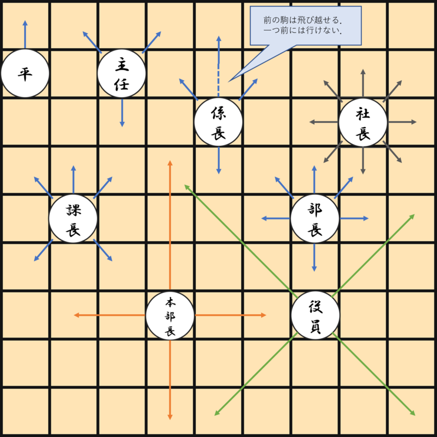
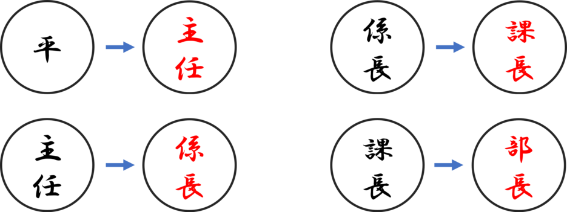

## Requirement
- Python 3.x
- numpy, opencv-python, Pillow

## Preparation
If needed, run below.
```
$ pip install -r requirements.txt
```

## Usage
```
$ python main.py
```

## How to play
社長を取られたプレイヤー，あるいは部長を全滅させられたプレイヤーの負け．

### 駒の動かし方


###　昇進
敵陣(開始時に相手駒の存在している行)に入ると昇進できる．現状昇進は拒否できない．組み合わせは以下．



